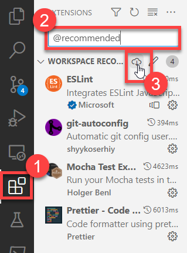
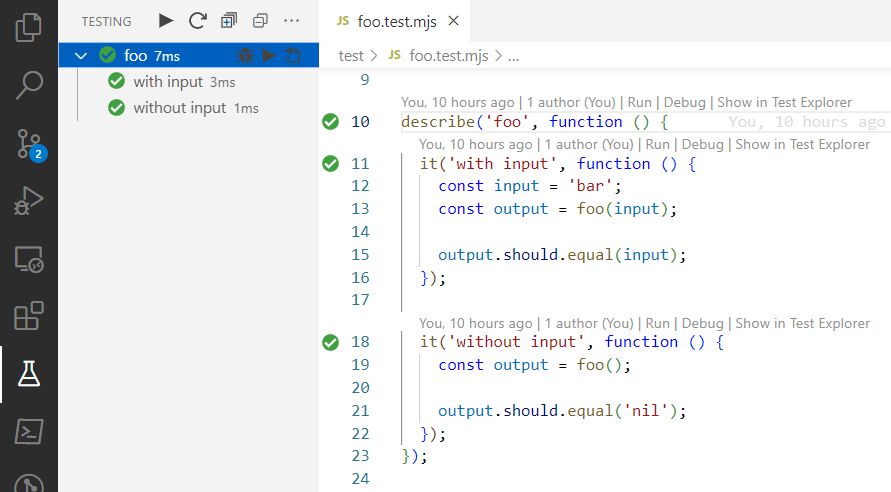

# NPM Package Template

You wrote a sweet piece of code! Releasing it on [NPM](https://www.npmjs.com/)
seems like the obvious next step. Right?

Try it. Not as easy to do from scratch as you might think.

So here's a plug-and-play NPM package template that offers the following
features:

- Support for the latest ES6 goodies with
  [`eslint`](https://www.npmjs.com/package/eslint) _uber alles_.

- A command line interface for your widget with
  [`commander`](https://www.npmjs.com/package/commander).

- Automated [`lodash`](https://www.npmjs.com/package/lodash) cherry-picking with
  [`babel-plugin-lodash`](https://www.npmjs.com/package/babel-plugin-lodash).

- [`mocha`](https://www.npmjs.com/package/mocha) &
  [`chai`](https://www.npmjs.com/package/chai) for testing, with examples, and a
  sweet testing console.

- Secure environment-variable access to [`package.json`](./package.json) data.

- Code formatting at every save & paste with
  [`prettier`](https://www.npmjs.com/package/prettier).

- One-button release to GitHub & publish to NPM with
  [`release-it`](https://www.npmjs.com/package/release-it).

If you want to create a React component in an NPM package, use my
[React Component NPM Package Template](https://github.com/karmaniverous/react-component-npm-package-template)
instead!

# Setting Up Your Dev Environment

**Use [VS Code](https://code.visualstudio.com/) as your code editor!** Not an
absolute requirement, but you'll be glad you did.

1.  [Click here](https://github.com/karmaniverous/npm-package-template/generate)
    to generate a new repository from this template.

1.  Clone the new repository to your local machine.

1.  VS Code will ask to install a bunch of recommended extensions. Accept all of
    them. If you miss this prompt, follow these steps:

    1. Open the VS Code Extensions tab
    1. Enter `@recommended` into the search box
    1. Click the Download link.

       

1.  Set the version in [`package.json`](./package.json) to `0.0.0`.

    See [Configuring `package.json`](#configuring-packagejson) for info on the
    rest of these settings.

1.  Install dependencies by running `npm install`.

1.  Run your tests from the command line:

    ```bash
    npm run test

    #  foo
    #    ✔ with input
    #    ✔ without input
    #
    #  2 passing (5ms)
    ```

    If you installed the VS Code extensions referenced above, use the `Testing`
    panel to visualize & run your unit tests.

     

1.  Build your package and link it locally by running:

    ```bash
    npm run build
    npm link
    ```

1.  Enter a few of your package CLI commands:

    ```bash
    npm-package-template

    # foo nil!

    npm-package-template -f bar

    # foo bar!

    npm-package-template -v

    # 0.0.0
    ```

1.  Clean up by unlinking your package.

    ```bash
    npm unlink -g @karmaniverous/npm-package-template
    ```

## Create Local Environment Variable File

Look for [`.env.local.template`](./.env.local.template) in your project
directory. Copy this file and remove the `.template` extension from the copy.

**Do not simply rename this file!** Anybody who pulls your repo will need this
template to create the same file in his own local environment.

## Connect to GitHub

This template supports automated release management with
[`release-it`](https://github.com/release-it/release-it).

If you use GitHub, create a
[Personal Access Token](https://github.com/settings/tokens/new?scopes=repo&description=release-it)
(`release-it` only needs "repo" access; no "admin" or other scopes). Add it as
the value of `GITHUB_TOKEN` in `.env.local`.

If you use GitLab, follow
[these instructions](https://github.com/release-it/release-it#gitlab-releases)
and place your token in the same file.

For other release control systems, consult the
[`release-it` README](https://github.com/release-it/release-it#readme).

You can now create a release at GitHub and optionally publish it to NPM with
this command:

```
npm run release
```

# Common Tasks

## Develop Package Exports

All custom package code lives in the [`src/export`](./src/export) directory.
Structure the contents of this directory however you like.

All package exports come together in
[`src/export/index.mjs`](src/export/index.mjs). You can cherry-pick from your
own source and organize your exports however you like. You can even
[re-export](https://jamesknelson.com/re-exporting-es6-modules/) imports from
other packages!

Do not move or rename [`src/export/index.mjs`](src/export/index.mjs) or your
build will break.

## Develop Package CLI

All custom command-line interface (CLI) code lives in the [`src/cli`](./src/cli)
directory. Structure the contents of this directory however you like.

The sample CLI is built using the very excellent
[`commander`](https://www.npmjs.com/package/commander) package, but you can use
whatever you want.

The only constraints:

- [`src/cli/index.mjs`](src/cli/index.mjs) is the execution point of your CLI.
  Do not move or rename this file or your build will break.

- [`src/cli/index.mjs`](src/cli/index.mjs) must begin with the following line:

  ```js
  #!/usr/bin/env node
  ```

## Pass `package.json` Data Into Environment Variables

This template uses
[`babel-plugin-transform-inline-environment-variables`](https://www.npmjs.com/package/babel-plugin-transform-inline-environment-variables)
to replace environment variable references in your code with string literals at
build time.

Currently it is pulling `version` from [`package.json`](./package.json) into
`process.env.NODE_PACKAGE_VERSION`. The same technique will work for any value
from a source you would rather not load at run time.

To add more values, see the comments in [`babel.config.js`](./babel.config.js).

## Create & Run Unit Tests

By default, this template supports
[`mocha`](https://www.npmjs.com/package/mocha) tests using the
[`chai`](https://www.npmjs.com/package/chai) assertion library. The included
sample tests express the [`should`](https://www.chaijs.com/guide/styles/#should)
assertion syntax.

The default configuration will recognize any file as a test file that...

- has `.test.` just before its file name extension (i.e. `example.test.js`).
- is not located in the `node_modules` or `lib` directories.

The sample code packages tests next to the source code they exercise. If you
prefer to segregate your tests into a directory outside [`src`](./src/) (e.g.
`test`), that will work as well.

Either way, all test files meeting the above conditions will be excluded from
the build.

To enable `mocha`-specific linting in your test files, add the following
directive at the top of every test file:

```js
/* eslint-env mocha */
```

The recommended
[Mocha Test Explorer](https://marketplace.visualstudio.com/items?itemName=hbenl.vscode-mocha-test-adapter)
extension will suface all of your tests into a sidebar console, nested to
reflect your `describe` hierarchy. It will also decorate your test source code
with test running and status reporting controls.


## Integration-Test Your Package

Generally, NPM packages are meant either to be included in other packages or to
be invoked from the command line. This template supports both.

To build your package and add it directly to your local development environment
as a global package, WITHOUT publishing it first to NPM, run these commands:

```bash
npm run build
npm link
```

You can now import your package into a JS module in any other package like this:

```js
// ES6
import myTemplate from '@karmaniverous/npm-package-template'; // default export
import { foo } from '@karmaniverous/npm-package-template'; // named export

// CommonJS
const myTemplate = require('@karmaniverous/npm-package-template'); // default export
const { foo } = require('@karmaniverous/npm-package-template'); // named export
```

You can also invoke your package's CLI from the command line, just like any
other global package with a CLI:

```bash
npm-package-template

# foo nil!

npm-package-template -f b

# foo bar!

npm-package-template -v

# 0.0.0
```

When you're finished, clean up your global environment by unlinking your
package:

```bash
npm unlink -g @karmaniverous/npm-package-template
```

## Create & Publish a Release

Before you can publish a package to [NPM](https://www.npmjs.com/), you'll need
to set up an NPM account.

### Package Scope & Access

Your NPM user name is a [_scope_](https://docs.npmjs.com/about-scopes). If you
create an organization, its unique organization name is also a scope.

_Unscoped_ packages have names like
[`lodash`](https://www.npmjs.com/package/lodash). An unscoped package name must
be unique across NPM.

_Scoped_ packages have names like
[`@karmaniverous/serify-deserify`](https://www.npmjs.com/package/@karmaniverous/serify-deserify).
`@karmaniverous` in this case is the scope. A scoped package name only needs to
be unique within its scope.

NPM packages may be _public_ or _private_. A
[public package](https://docs.npmjs.com/about-public-packages) can be seen and
used by anyone. A
[private package](https://www.npmjs.com/package/@karmaniverous/serify-deserify)
can only be seen & used by your collaborators or other users with access to your
organization scope.

Only scoped packages can be private. Only paid NPM accounts can create private
packages.

Even if you are only creating public packages, it is a good idea to create
_scoped_ packages because it groups them logically and gives you much more
flexibility in naming them.

[Click here](https://docs.npmjs.com/packages-and-modules/introduction-to-packages-and-modules)
for more info about NPM package scope & access.

### Configuring `package.json`

When you publish an NPM package, NPM gets most of its info from your
[`package.json`](./package.json) file.

Set the following values in [`package.json`](./package.json), using the template
file as an example.

This info is critical. You can't publish your package properly without it:

- `name` – The desired package name on NPM. Include scope if relevant. See
  [Package Scope & Access](#package-scope--access) for more info.

- `version` - Your package version. Uses
  [semantic versioning](https://www.geeksforgeeks.org/introduction-semantic-versioning/).
  Set this initially to `0.0.0` and the template's
  [release process](#create--publish-a-release) will manage it from there.

- `publishConfig.access` - `restricted` for private packages, otherwise
  `public`. See [Package Scope & Access](#package-scope--access) for more info.

- `repository.url` - GitHub repository URL.

This info is important but you can always update it in the next release:

- `author` - Your name, however you'd like it to appear.

- `bugs.url` - A URL for users to report bugs. By default, use the
  [issues page](https://github.com/karmaniverous/npm-package-template/issues) of
  your GitHub repo.

- `description` - A text description of your package. Will be used as the META
  description of your NPM package page, so keep it under 160 chars.

- `homepage` - The main web page of your project. By default, use your GitHub
  repo's
  [README link](https://github.com/karmaniverous/npm-package-template#readme).

- `keywords` - An array of strings that will appear as tags on the NPM package
  page.

- `license` - The license associated with your package. See this list of
  [valid license identifiers](https://spdx.org/licenses/).

### Generating the Release

Before you begin, ensure you have committed all changes to your working branch.

Run this command:

```bash
npm run release
```

You will be asked to select a release increment. Otherwise accept all defaults.
Your release will be generated on GitHub and published to NPM.

Note that if you have configured Two-Factor Authentication at NPM you will be
asked to enter a One-Time Password (OTP).

Add other [`release-it`](https://github.com/release-it/release-it#readme)
options after `---` (Windows) or `--` (Mac/Linux). For example, to specify a
patch release, and accept all defaults with no user interaction, run this
command:

```bash
# Windows only.
npm run release --- patch --ci

# Mac/Linux.
npm run release -- patch --ci
```

See the [`release-it` README](https://github.com/release-it/release-it#readme)
for more info on available options.

### Weird NPM Warning

The release process is currently generating this warning:

```text
WARNING Unable to verify if user karmaniverous is a collaborator for @karmaniverous/npm-package-template.
```

The warning appears to be coming from NPM; when I disable NPM publishing the
warning goes away. My NPM account IS linked to my GitHub account, so that isn't
the issue.

The warning doesn't appear to affect the publishing process.
[Click here](https://github.com/release-it/release-it/issues/960) to track this
issue.

## Integrate a Template Update

Follow
[these instructions](https://karmanivero.us/blog/installing-github-repo-template-updates/).

# FAQ

## Why do most of your source files have an `.mjs` extension?

Because this template is a
[CommonJS package](https://nodejs.org/api/packages.html#type)!

Which is weird, right? Becuae
[right at the top of this document](#npm-package-template) we demanded _support
for the latest ES6 goodies!_

Meanwhile, your NPM package is only useful if it will run anywhere it needs to
run. So the code you publish to NPM should support the lowest-common-denominator
platform, meaning it _has_ to be a CommonJS package.

We get there in two steps:

1. Compose our fancy ES6 code in `.mjs` files in the [`src`](./src/) directory.
   This is what we push to GitHub.

1. Invoke [`babel`](https://babeljs.io/) via `npm run build` to transpile the
   ES6 contents of the [`src`](./src/) directory into `.js` files in the `lib`
   directory. This directory does NOT get pushed to GitHub... but it DOES get
   published to NPM!

## How do I import a `.json` file into an ES6 module?

CommonJS allows you to `require` a `.json` file directly into a JavaScript
object, as in
[this example from `babel.config.js`](https://github.com/karmaniverous/npm-package-template/blob/3b63de057330fbe47e49645cb0bc735c59683100/babel.config.js#L1-L2):

```js
const { version } = require('./package.json');
```

The `require` function is not valid in ES6. You might consider doing this
instead...

```js
import pkg from './package.json';
const { version } = pkg;
```

But you would find that the `import` statement is not valid for the `json` MIME
type.

This has been addressed with
[_import assertions_](https://v8.dev/features/import-assertions), so now you can
write this:

```js
import pkg from './package.json' assert { type: 'json' };
const { version } = pkg;
```

[@babel/core](https://www.npmjs.com/package/@babel/core) doesn't support this
syntax yet, so while the statement above is valid, by default it would cause a
build error.

**This template includes
[`@babel/plugin-syntax-import-assertions`](https://www.npmjs.com/package/@babel/plugin-syntax-import-assertions),
which adds support for import assertions to Babel.**
